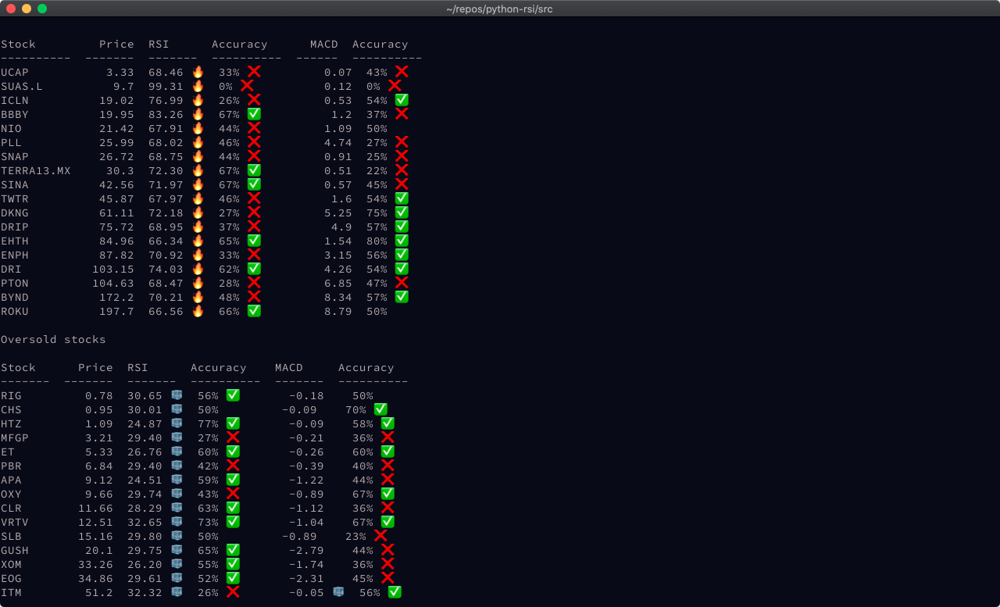

# stock-analyzer

## About

A basic stock analyzer of the tickers that are available in the mexican market using [GBM Homebroker](https://plus.gbm.com/index.html) as your broker.

This analyzer pulls historic data of the ticker using [pandas_datareader](https://pandas-datareader.readthedocs.io/en/latest/). Then stores the close price of each day in an specific csv for the ticker.

Then analyzes based on this close prices the technical indicator of [RSI](https://www.investopedia.com/terms/r/rsi.asp) and [MACD](https://www.investopedia.com/terms/m/macd.asp). With this estimators, the code will tell you if the stock based on only that indicator is in a bullish or bearish trend.

In addition to this, the code will also give you an accuracy of the indicator of this ticker. For example if the RSI is something that you should based your decision on, or not.

## Disclaimer

This repository is only for educational purposes. The owner and contributors of this repository are not responsible for how you use this code and the gains/losses you accumulate.
